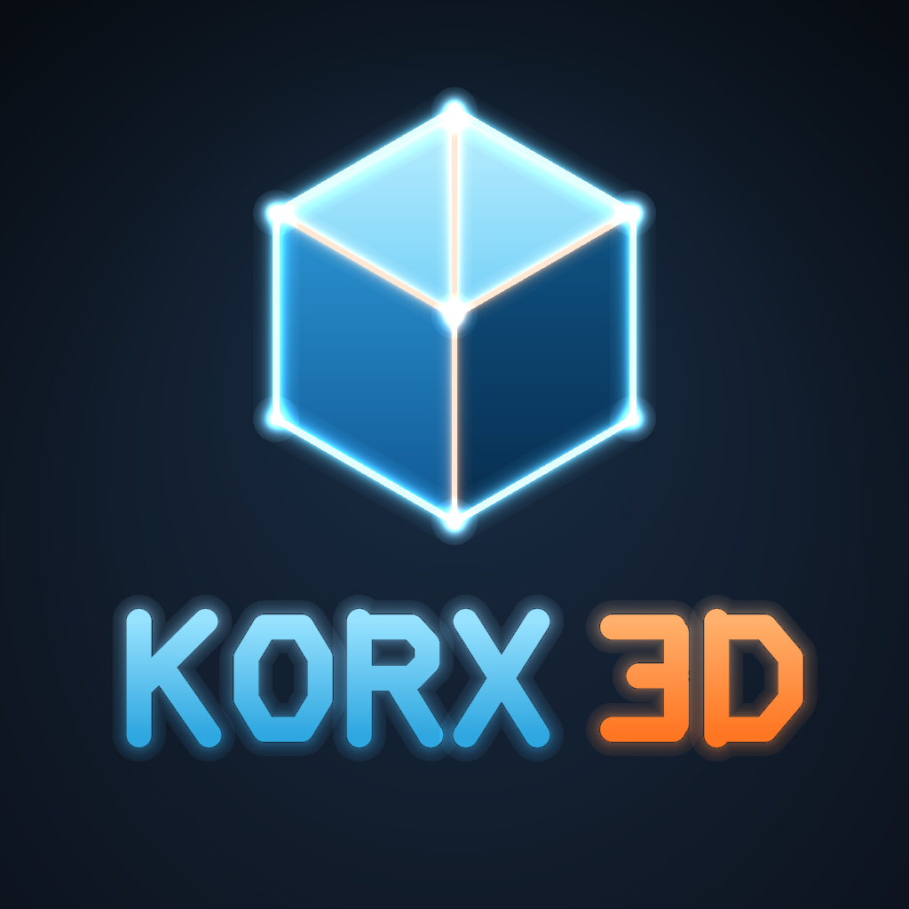

# Korx 3D 🧊

<p align="center"></p>

App de **modelagem 3D fácil e fluida** feito sob medida para o **Samsung Galaxy Tab S10 FE** com **S Pen** — no estilo do "3D modeling: Design my model", com edição direta como no Fusion.

| Editor | Esboço extrudado com furo |
|---|---|
|  |  |

## 📲 Como instalar no tablet

1. Abra a página **[Releases](../../releases)** deste repositório no navegador do tablet.
2. Baixe o arquivo **`Estudio3D.apk`** (Korx 3D).
3. Toque no arquivo baixado, permita *"instalar apps desconhecidos"* (só na primeira vez) e instale.

> O APK também fica salvo em [`apk/Estudio3D.apk`](apk/Estudio3D.apk).
> O app funciona 100% offline e não pede nenhuma permissão.

## ✏️ Recursos

- **Formas prontas**: cubo, esfera, cilindro, cone, anel, placa e rampa — e **Texto 3D** e **Imagem**.
- **Esboço com a S Pen**: desenhe (livre, retângulo, círculo) e **extrude**; desenhos dentro de outros viram furos; altura ajustável ao vivo.
- **✨ Correção mágica**: a IA local reconhece círculos, estrelas, retângulos, triângulos e polígonos desenhados à mão e os deixa perfeitos.
- **Recortar**: desenhe sobre a peça para **remover** material (recorte por desenho livre ou formas).
- **Mesclar**: une duas peças encostadas em uma só (união booleana real).
- **Pintar**: pincel com tamanho ajustável para pintar as faces com a caneta.
- **Cores**: seletor completo com gradiente (estilo Excel), código hex, cores recentes e acabamentos **fosco, brilhante, metálico e camaleão**.
- **Imagem → 3D**: relevo automático regulável (litofania) ou contorno vetorizado extrudado.
- **Suavizar**: transforme um cubo em formas arredondadas subdividindo as faces (0–3 níveis).
- **Escala**: botões −/+ de escala uniforme (sem deformar), campo em % e escala livre por eixo no gizmo.
- **Vista completa**: orbite até por baixo da peça; atalhos 3D/Topo/Baixo/Frente/Direita.
- **Importa** STL, 3MF, OBJ, GLB (inclusive arquivos grandes) · **Exporta** STL, 3MF, OBJ, GLB em milímetros.
- **Enviar para a impressora**: depois de exportar, compartilhe direto com Bambu Handy, Creality Print ou o app da sua impressora.
- **Projetos** `.e3d` reabríveis + recuperação automática da última sessão · desfazer/refazer para tudo.

### Ferramentas avançadas (estilo Fusion / CAD)

- **Esculpir**: deforme a peça com pincel — inflar, afundar, suavizar e puxar; malhas grosseiras ganham resolução automaticamente.
- **Borracha**: apaga a tinta com a caneta, como um pincel de apagar.
- **Esboço por pontos**: coloque nós e arraste-os para ajustar o contorno antes de extrudar/recortar.
- **Mesclar qualquer malha**: união booleana exata para peças leves e **combinação rápida** para malhas com milhões de faces.
- **Codificação → 3D**: escreva código (JS) e gere objetos paramétricos (engrenagem, vaso, parafuso…) com a API `K.*`.
- **Adicionar sobre a peça**: novos objetos apoiam no topo da seleção; o **texto pode acompanhar o contorno** ondulado da superfície.
- **Régua mm/cm**: barra graduada sobre a cena + cotas da peça; aparece ao escalar e como acessório do painel.
- **CAD**: medir distância, espelhar (X/Y/Z), matriz linear e circular, furo rápido e vista **ortográfica**.
- **Painel rolável** com gaveta de Ferramentas e Acessórios sempre acessíveis.

## 🔧 Como o APK é construído

Todo push dispara o workflow [`build.yml`](.github/workflows/build.yml): o `esbuild` empacota o editor (`web/src/*.js` + three.js), `scripts/build_apk.sh` monta o APK nativo (`aapt2 → javac → d8 → zipalign → apksigner`) e o resultado é publicado na Release **estudio3d-apk** e comitado em `apk/`.

```
web/       editor 3D (HTML/CSS/JS, PWA)
android/   app Android (WebView, bridge p/ Downloads + compartilhar, ícones, keystore)
scripts/   gerador do logo e build do APK
```

> O keystore em `android/keystore/` (senha `estudio3d`) assina este app pessoal —
> mantê-lo no repositório permite que atualizações instalem por cima da versão anterior.

## 🌐 Alternativa sem APK (PWA)

O diretório `web/` também é um PWA instalável: sirva-o em HTTPS (por exemplo, GitHub Pages),
abra no Chrome do tablet e use **"Adicionar à tela inicial"**.
