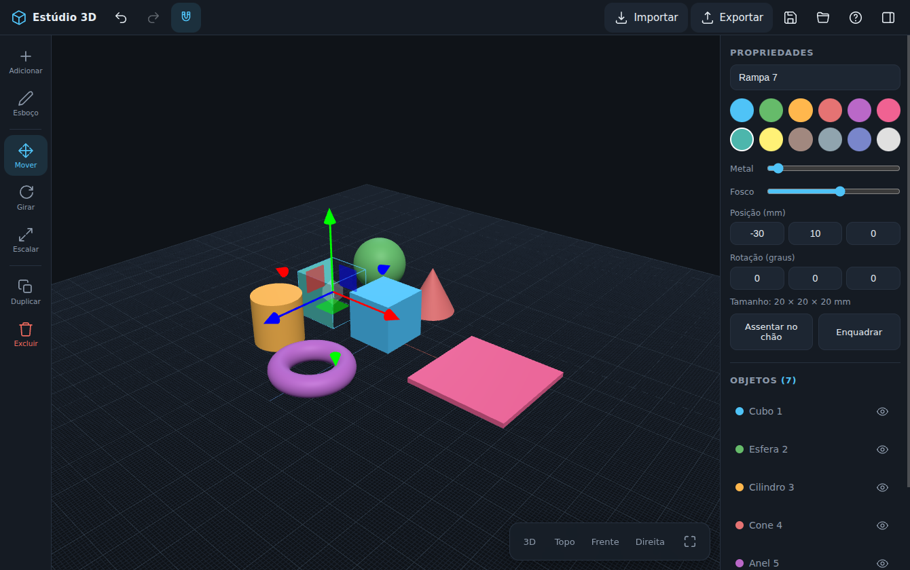
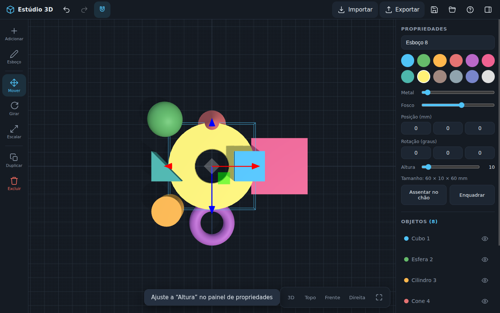

# Estúdio 3D 🧊

App de **modelagem 3D fácil e fluida** feito sob medida para o **Samsung Galaxy Tab S10 FE** com **S Pen** — no estilo do "3D modeling: Design my model", com edição direta como no Fusion.

| Editor | Esboço extrudado com furo |
|---|---|
|  |  |

## 📲 Como instalar no tablet

1. Abra a página **[Releases](../../releases)** deste repositório no navegador do tablet.
2. Baixe o arquivo **`Estudio3D.apk`**.
3. Toque no arquivo baixado. O Android vai pedir permissão para *"instalar apps desconhecidos"* do navegador — permita (só na primeira vez).
4. Toque em **Instalar**. Pronto — o "Estúdio 3D" aparece na tela inicial.

> O APK também fica salvo em [`apk/Estudio3D.apk`](apk/Estudio3D.apk) neste repositório.
> O app funciona 100% offline e não pede nenhuma permissão.

## ✏️ Como usar

| Gesto | Ação |
|---|---|
| Um dedo | girar a vista |
| Dois dedos | zoom e deslocar |
| S Pen: toque | selecionar objeto |
| S Pen: arrastar objeto | mover no plano |
| S Pen: botão lateral + arrastar | deslocar a vista |
| Gizmo (setas/anéis/caixas) | mover, girar e escalar com precisão |

- **Adicionar** — cubo, esfera, cilindro, cone, anel, placa e rampa.
- **Esboço** — desenhe com a caneta (traço livre, retângulo, círculo) e toque em **Extrudar** para virar sólido. Desenhos dentro de outros viram **furos**.
- **Importar** — STL, 3MF, OBJ e GLB (inclusive arquivos grandes).
- **Exportar** — STL binário e 3MF (prontos para fatiadores, em milímetros e eixo Z para cima), OBJ e GLB. Os arquivos vão para a pasta **Downloads**.
- **Salvar projeto** — arquivo `.e3d` reabrível com tudo editável; há também recuperação automática da última sessão.
- **Ímã** — encaixe de 1 mm e 15° para montagens precisas.

## 🔧 Como o APK é construído

Todo push dispara o workflow [`build.yml`](.github/workflows/build.yml):

1. `esbuild` empacota o editor (`web/src/*.js` + three.js) em `web/dist/app.js`;
2. `scripts/build_apk.sh` monta o APK nativo (WebView + bridge de arquivos) com `aapt2 → javac → d8 → zipalign → apksigner`;
3. o APK assinado é publicado na Release **estudio3d-apk** e comitado em `apk/`.

Estrutura:

```
web/       editor 3D (HTML/CSS/JS, PWA)
android/   app Android (WebView, bridge p/ Downloads, ícones, keystore)
scripts/   gerador de ícones e build do APK
```

> O keystore em `android/keystore/` (senha `estudio3d`) serve só para assinar este app pessoal —
> mantê-lo no repositório permite que atualizações futuras instalem por cima da versão anterior.

## 🌐 Alternativa sem APK (PWA)

O diretório `web/` também é um PWA instalável: sirva-o em HTTPS (por exemplo, GitHub Pages),
abra no Chrome do tablet e use **"Adicionar à tela inicial"**.
