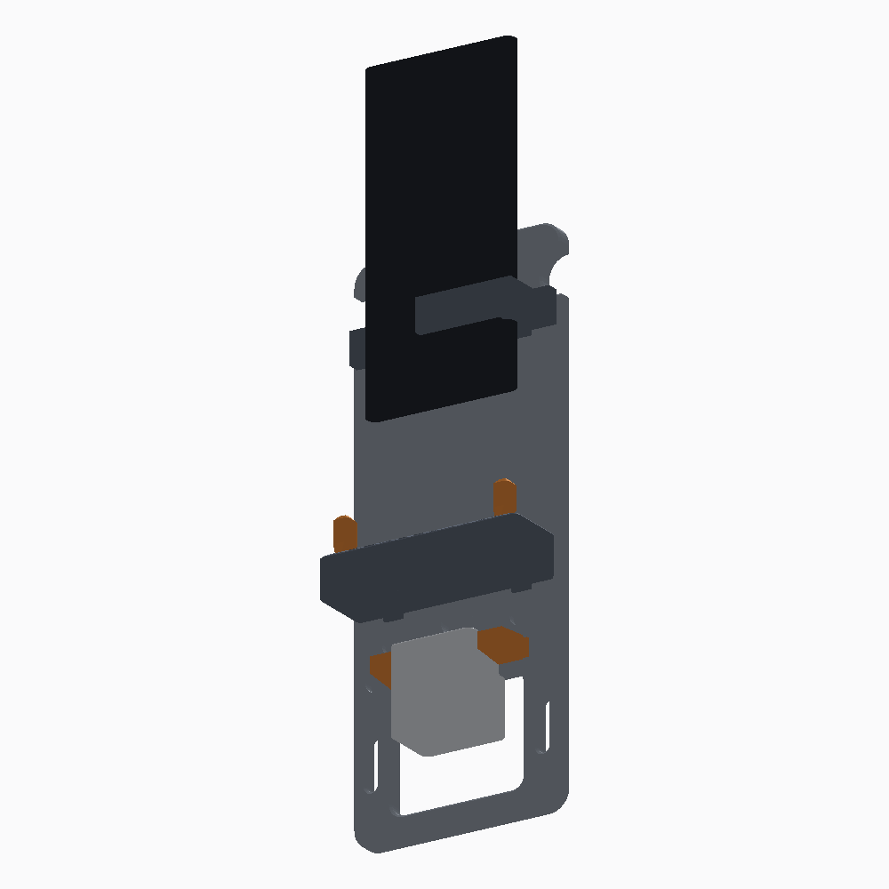
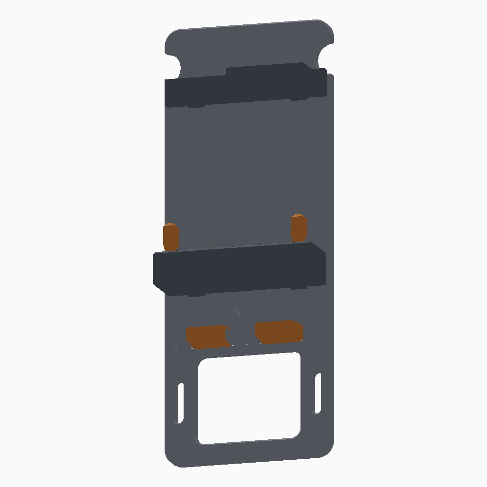

# Dock de parede universal para celular 🔌📱

Substitui o `iPhoneWallMountPhoneHolder.3mf` (que era um berço fixo, só para
iPhone, preso com fita 3M) por um **sistema modular ajustável que se apoia na
própria tomada** — sem furar a parede e com o celular carregando.

**Arquivo para imprimir: [`out/DockParedeUniversal.3mf`](out/DockParedeUniversal.3mf)**
(as 7 peças já posicionadas na mesa). Os STLs avulsos estão em `out/`.

| Montado | Só as peças |
|---|---|
|  |  |

## O que mudou em relação ao original

| | Original | Este |
|---|---|---|
| Celular | só iPhone 12–17 | qualquer um: até 92 mm de largura, 16 mm de espessura e ~120–175 mm de altura |
| Preensão | só a base | base **e** topo, com a lateral direita (power) livre |
| Ajuste | nenhum | altura, largura e posição do carregador |
| Fixação | fita 3M | **trava no carregador da tomada** (+ fita e/ou parafuso do espelho, opcionais) |
| Carregador | só um recorte para o cabo | janela com garras e trava para o plugue |
| Cabo | solto | calha embutida + chifres para enrolar a sobra |
| Malha | 873.404 faces vindas de um STEP | 8.302 faces, paramétrica, verificada peça a peça |

## Como funciona

A **espinha** encosta na parede com a janela por cima da tomada. O carregador
atravessa a janela e é plugado normalmente; as duas **garras** deslizam pelo
trilho horizontal até apertar as laterais do plugue, e o lábio da frente
funciona como **trava**, impedindo que ele se solte. O conjunto fica pendurado
no carregador, com a placa apoiada na parede/espelho — é ela que aguenta o
tombamento, o plugue só segura o peso para baixo.

O **berço** e o **grampo** deslizam nos dois trilhos rabo-de-andorinha e são
travados por atrito na posição que você escolher: o berço define onde a base do
celular apoia, o grampo desce até o lábio encostar na frente do aparelho. Como o
grampo abraça só o canto superior **esquerdo**, a lateral direita inteira fica
livre para o botão power e o volume.

As duas **orelhas** entram em qualquer par dos 12 furos da parede da frente do
berço (passo de 8 mm) e centralizam o aparelho: dá para fechar de ~80 mm até
encostar uma na outra. Celular mais largo que isso dispensa as orelhas e usa o
bolso inteiro, de 92 mm.

O cabo sobe pela **calha** no meio da placa, sai por baixo do berço e entra pela
abertura do piso direto no conector. A sobra do fio se enrola nos **entalhes**
do topo, em oito.

> ⚠️ Peso: dock + celular dá ~450 g pendurados no plugue. Funciona bem em tomada
> nova e firme. Se a sua for velha ou frouxa, use os dois **rasgos oblongos** ao
> lado da janela para prender a placa no parafuso do espelho 4×2 (furos a 86 mm,
> sem furar parede nenhuma), ou cole duas fitas 3M Command nas costas — elas são
> planas e lisas de propósito.

## Impressão na Creality K2

Tudo imprime **sem suporte**: nenhuma peça tem saliência abaixo de ~49°, e os
canais rabo-de-andorinha já saem estreitos na boca e largos por dentro.

| Peça | Qtd | Tamanho | Volume |
|---|---|---|---|
| `01_espinha` | 1 | 104 × 268 × 8 mm | 156,7 cm³ |
| `02_berco` | 1 | 100 × 37 × 20 mm | 40,6 cm³ |
| `03_grampo_superior` | 1 | 100 × 29 × 16 mm | 16,5 cm³ |
| `04_garra_carregador` | 2 | 23 × 12 × 22 mm | 3,5 cm³ |
| `05_orelha_lateral` | 2 | 8 × 9 × 26 mm | 1,2 cm³ |

Ocupa 276 × 274 mm na mesa — cabe folgado na K2 Plus (350 × 350).

**Perfil sugerido** (bico 0,4):

- camada **0,2 mm**, primeira camada 0,25
- **4 perímetros** e **5 camadas** de topo/fundo — é o que dá a rigidez, não o preenchimento
- preenchimento **25 % giroide**
- material: **PETG** (melhor; aguenta sol e calor do carregador) ou **PLA+**.
  PLA comum perto de janela ensolarada pode entortar.
- **sem suporte**, sem balsa; brim de 5 mm só nas garras e orelhas se sua mesa
  estiver descolando peça pequena
- imprima a espinha com a face lisa (a das costas) para baixo — é como o 3MF já
  vem posicionado

Se os deslizantes ficarem duros ou frouxos demais, ajuste `FOLGA` em
`mount.py` (padrão 0,30 mm) e gere de novo.

## Montagem

1. Encaixe o **berço** por cima, pela ponta do trilho, e empurre até a altura
   que quiser (deixe ~15 mm de folga abaixo da tomada, para o cabo).
2. Ponha as **orelhas** nos furos que correspondam à largura do seu celular.
3. Encaixe o **grampo** pelo topo do trilho e desça até o lábio tocar a frente
   do aparelho.
4. Deslize as duas **garras** pelo trilho horizontal, plugue o carregador e
   feche-as contra ele até travar.
5. Passe o cabo pela calha, ligue no celular e enrole a sobra nos chifres.

## Regerar / personalizar

Sem nenhuma dependência externa — só Python 3:

```bash
cd cad
python3 build.py     # confere as malhas e gera out/*.stl + o 3MF
python3 render.py    # gera as pré-visualizações
```

As medidas ficam no topo de [`mount.py`](mount.py) (largura da placa, altura,
posição dos trilhos, tamanho da janela do carregador, folga…). O motor de
sólidos é o [`kernel.py`](kernel.py): extrusão de contornos com furos, bolsos
cegos, booleanas por árvore BSP, costura de T-junctions e exportação STL/3MF.

`build.py` recusa exportar qualquer peça que não passe na verificação de malha
fechada (arestas abertas = 0, arestas repetidas = 0, volume positivo).
